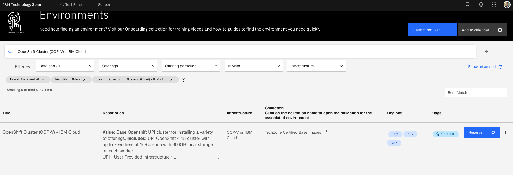
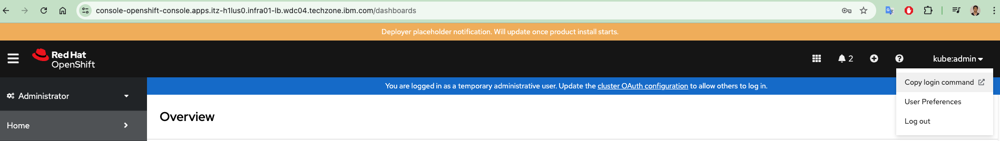
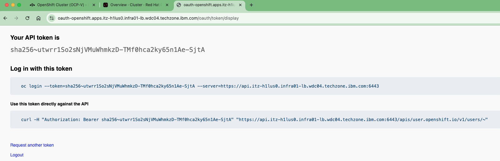
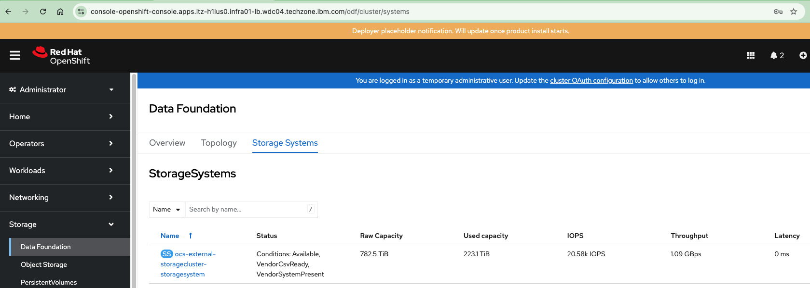
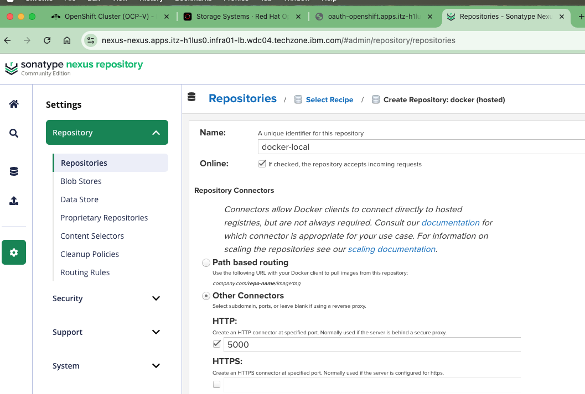
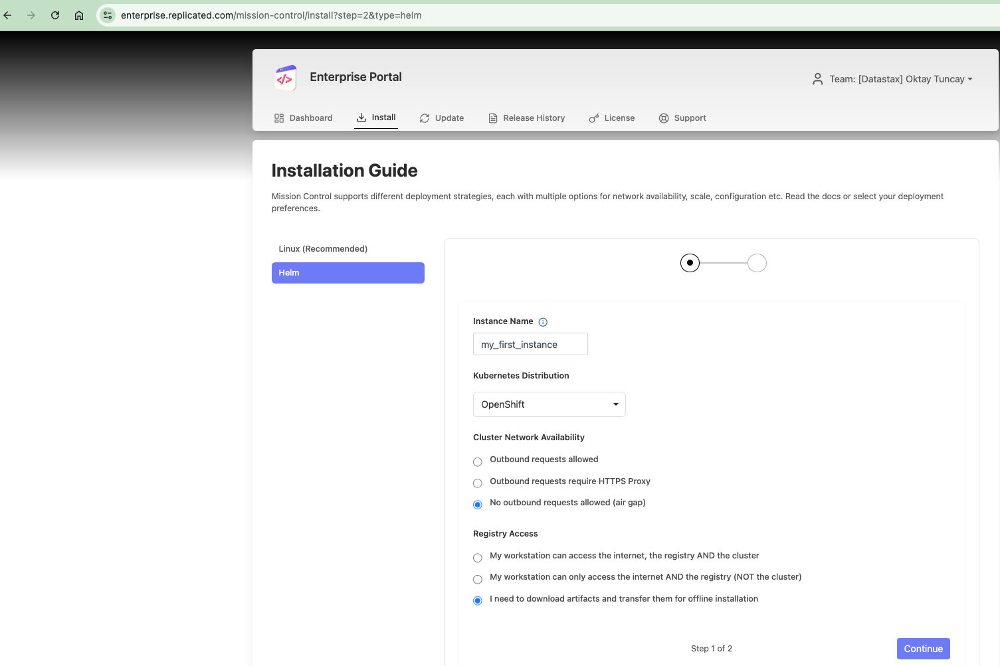
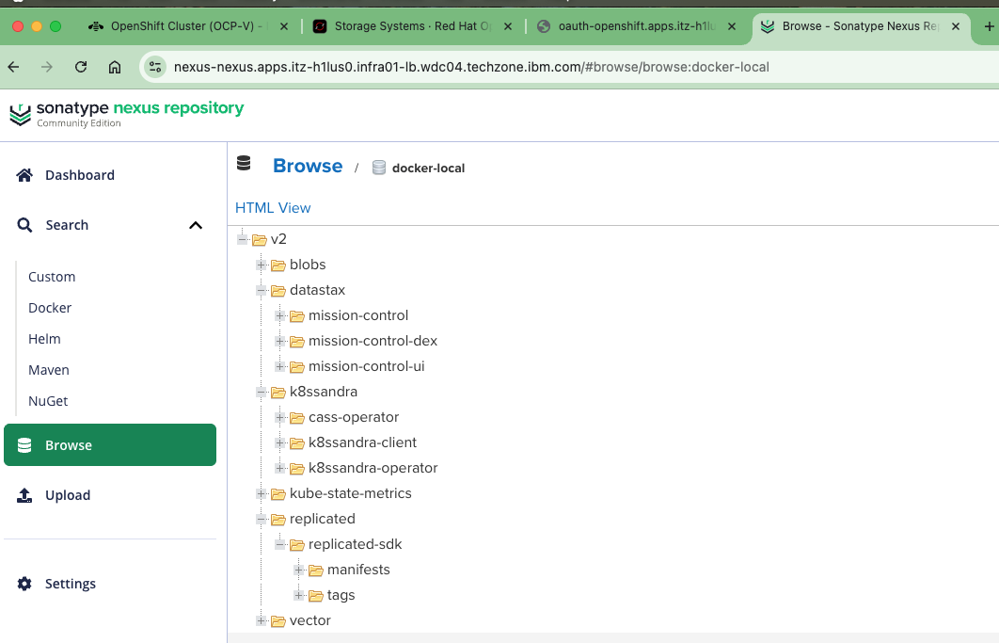
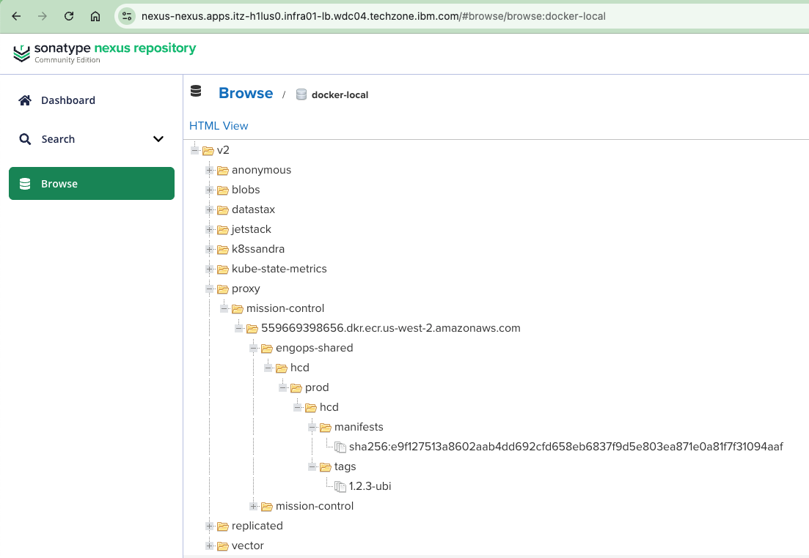
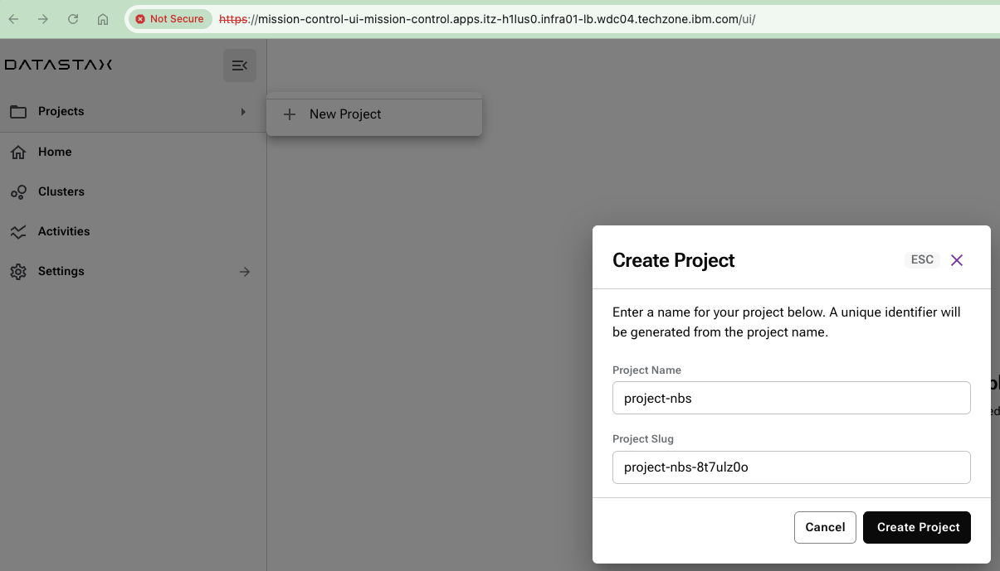
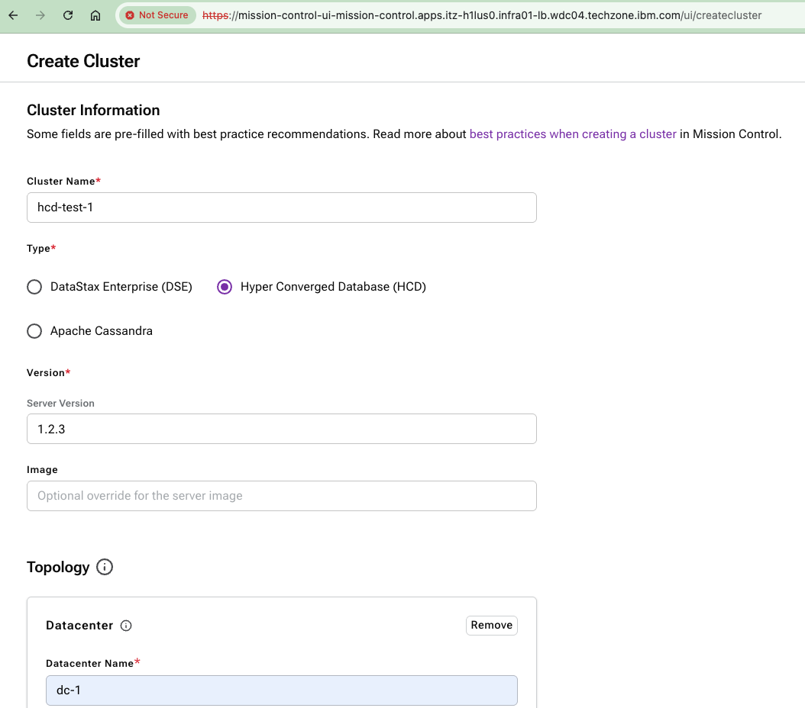

# Mission Control & HCD Air‑Gapped Install on OpenShift

> This runbook outlines the comprehensive procedure for deploying a production-ready Hyper-Converged Database (HCD) cluster within an air-gapped OpenShift environment. It utilizes a declarative approach to preemptively resolve network isolation and configuration constraints, ensuring a seamless startup without the need for manual patching or intervention.

## Environment Provisioning and Prerequisites

> It is necessary to provision a suitable environment for the installation. The most suitable option for IBM environments is the OpenShift Cluster (OCP-V) - IBM, located under TechZone Certified Base Images, as shown in the screenshot below.

<p align="middle">
  
</p>

> **The following options were selected for this setup:**
> - **OpenShift Version:** 4.18
> - **Worker Node Count:** 3
> - **Worker Node Flavor:** 8 vCPU x 32 GB - 100 GB ephemeral storage

> Once the environment is ready, you can find the bastion host SSH connection details and password on the environment page. Using these credentials, you can connect to the bastion host from your local machine.

```shell
(base) oktay.tuncay@Oktay-Tuncay ~ % ssh itzuser@api.itz-h1lus0.infra01-lb.wdc04.techzone.ibm.com -p 10022

[itzuser@itz-h1lus0-helper-1 ~]$ sudo su -
```

> Click the OCP Console link on the same page, sign in to the OpenShift UI using the *kube:admin* user, and copy the token from the **Copy login command** section at the top of the page, as shown below.

<p align="middle">
  
</p>

<p align="middle">
  
</p>

> Authenticate to the OpenShift Container Platform (OCP) command-line interface (CLI) using the token you copied.

> 📌 **Note:** The token here is renewed at regular intervals.

```shell
[root@itz-h1lus0-helper-1 ~]# oc login --token=sha256~SEe2tu7ZIg2OiE_VX0huymYMM1uftpPXiTVQCpze_gs --server=https://api.itz-h1lus0.infra01-lb.wdc04.techzone.ibm.com:6443
Logged into "https://api.itz-h1lus0.infra01-lb.wdc04.techzone.ibm.com:6443" as "kube:admin" using the token provided.

You have access to 87 projects, the list has been suppressed. You can list all projects with 'oc projects'

Using project "mission-control".
[root@itz-h1lus0-helper-1 ~]# 
```
1. **Check `OC`, `Helm`, `Docker` are installed on the bastion/helper node.**

    Make sure that Helm v3.12+ and Docker are installed on the server.

    ```shell
    oc version
    ```

    ```shell
    helm version
    ```

    ```shell
    docker version
    ```

    💡 **Expected Output:**
    ```shell
    [root@itz-h1lus0-helper-1 ~]# oc version
    Client Version: 4.18.28
    Kustomize Version: v5.4.2
    Server Version: 4.18.28
    Kubernetes Version: v1.31.13
    ```

    > In my case, I installed both Helm and Docker manually. When you check their versions, you will see that they are now installed, even if they were not present before.

    💡 **Expected Output:**
    ```shell
    [root@itz-h1lus0-helper-1 ~]# helm version
    bash: helm: command not found...

    Install package 'helm' to provide command 'helm'? [N/y] y

    * Waiting in queue... 
    * Loading list of packages.... 
    The following packages have to be installed:
    helm-3.19.0-1.el9.x86_64	The Kubernetes Package Manager
    Proceed with changes? [N/y] y
    ...
    ...
    ```

    ```shell
    [root@itz-h1lus0-helper-1 ~]# docker version
    bash: docker: command not found...
    Install package 'podman-docker' to provide command 'docker'? [N/y] y

    * Waiting in queue... 
    * Loading list of packages.... 
    The following packages have to be installed:
    ...
    ...
    Emulate Docker CLI using podman. Create /etc/containers/nodocker to quiet msg.
    Client:       Podman Engine
    Version:      5.6.0
    API Version:  5.6.0
    Go Version:   go1.24.6 (Red Hat 1.24.6-1.el9)
    Built:        Mon Nov 10 08:54:39 2025
    OS/Arch:      linux/amd64
    ```

    > It is recommended to check the storage class and available storage capacity before starting the installation.

2. **Check Storageclass**

    💡 **Expected Output:**
    ```shell
    [root@itz-h1lus0-helper-1 ~]# oc get storageclass
    NAME                                             PROVISIONER                             RECLAIMPOLICY   VOLUMEBINDINGMODE   ALLOWVOLUMEEXPANSION   AGE
    ocs-external-storagecluster-ceph-rbd (default)   openshift-storage.rbd.csi.ceph.com      Delete          Immediate           true                   3h19m
    ocs-external-storagecluster-cephfs               openshift-storage.cephfs.csi.ceph.com   Delete          Immediate           true                   3h19m
    openshift-storage.noobaa.io                      openshift-storage.noobaa.io/obc         Delete          Immediate           false                  3h18m
    ```

    > You can also check the storage capacity in the OpenShift UI (OCP Console).

    <p align="middle">
    
    </p>

3. **Check that `skopeo` and `yq` are installed on the bastion.**

    ```shell
    skopeo --version
    ```

    ```shell
    yq --version
    ```

    > In my case, I manually installed skopeo and yq. Verifying their versions shows that the installation was successful.

    💡 **Expected Output:**
    ```shell
    [root@itz-h1lus0-helper-1 ~]# skopeo --version
    bash: skopeo: command not found...
    Install package 'skopeo' to provide command 'skopeo'? [N/y] y

    * Waiting in queue... 
    * Loading list of packages.... 
    ...
    ...
    ```

    ```shell
    [root@itz-h1lus0-helper-1 ~]# yq --version
    bash: yq: command not found...
    Install package 'yq' to provide command 'yq'? [N/y] y
    ...
    ...
    yq (https://github.com/mikefarah/yq/) version v4.47.1
    ```

### Deploying Nexus (Namespace, PVC, Deployment, Services, and Route)

> 📣 **Role of Each Component:**
> - **Namespace nexus:** Isolates the Nexus deployment.
> - **ServiceAccount nexus-sa:** The pod runs under this service account.
> - **PVC nexus-data:** Provides persistent storage for Nexus (/nexus-data).
> - **Deployment nexus:** Runs the Nexus 3 container and exposes ports 8081 (UI) and 5000 (Docker registry).
> - **Service nexus:** Exposes the Nexus UI inside the cluster.
> - **Service nexus-docker:** Exposes the Docker registry inside the cluster on port 5000.
> - **Route nexus:** Exposes the Nexus UI externally through the OpenShift router (HTTPS, edge-terminated).


1. Use the following command to download the `nexus.yaml` file to the helper node.

    ```shell
    wget https://raw.githubusercontent.com/oktytncy/airgapped-hcd-openshift-runbook/main/manifests/nexus.yaml -O nexus.yaml
    ```

2. After downloading the YAML file, deploy Nexus using the command below.

    ```shell
    oc apply -f nexus.yaml
    ```

    💡 **Expected Output:**

    ```shell
    [root@itz-h1lus0-helper-1 ~]# ls
    anaconda-ks.cfg  nexus.yaml  original-ks.cfg
    [root@itz-h1lus0-helper-1 ~]# oc apply -f nexus.yaml
    namespace/nexus created
    serviceaccount/nexus-sa created
    persistentvolumeclaim/nexus-data created
    Warning: would violate PodSecurity "restricted:latest": allowPrivilegeEscalation != false (container "nexus" must set securityContext.allowPrivilegeEscalation=false), unrestricted capabilities (container "nexus" must set securityContext.capabilities.drop=["ALL"]), runAsNonRoot != true (pod or container "nexus" must set securityContext.runAsNonRoot=true), seccompProfile (pod or container "nexus" must set securityContext.seccompProfile.type to "RuntimeDefault" or "Localhost")
    deployment.apps/nexus created
    service/nexus created
    service/nexus-docker created
    route.route.openshift.io/nexus created
    ```

3. Grant the required SCC to allow Nexus to write to /nexus-data.

    ```shell
    oc adm policy add-scc-to-user anyuid -z nexus-sa -n nexus
    ```

4. Verify and retrieve the admin password — it may take a few minutes for the pod to reach the **Running** status.

    ```shell
    oc get pods -n nexus -w
    ```

    ```shell 
    NEXUS_HOST=$(oc get route nexus -n nexus -o jsonpath='{.spec.host}')
    ```

    ```shell 
    echo "Nexus UI: https://${NEXUS_HOST}"
    ```

    ```shell 
    POD=$(oc get pod -n nexus -l app=nexus -o jsonpath='{.items[0].metadata.name}')
    ```

    ```shell 
    oc exec -n nexus "$POD" -- cat /nexus-data/admin.password
    # Username: admin
    # Password: (value printed above)
    ```

    💡 **Expected Output:**

    ```shell
    [root@itz-h1lus0-helper-1 ~]# oc get pods -n nexus 
    NAME                     READY   STATUS    RESTARTS   AGE
    nexus-5d654f779f-l2jdd   1/1     Running   0          56s
    [root@itz-h1lus0-helper-1 ~]# 
    [root@itz-h1lus0-helper-1 ~]# NEXUS_HOST=$(oc get route nexus -n nexus -o jsonpath='{.spec.host}')
    [root@itz-h1lus0-helper-1 ~]# 
    [root@itz-h1lus0-helper-1 ~]# echo "Nexus UI: https://${NEXUS_HOST}"
    Nexus UI: https://nexus-nexus.apps.itz-h1lus0.infra01-lb.wdc04.techzone.ibm.com
    [root@itz-h1lus0-helper-1 ~]# 
    [root@itz-h1lus0-helper-1 ~]# POD=$(oc get pod -n nexus -l app=nexus -o jsonpath='{.items[0].metadata.name}')
    [root@itz-h1lus0-helper-1 ~]# 
    [root@itz-h1lus0-helper-1 ~]# oc exec -n nexus "$POD" -- cat /nexus-data/admin.password
    346e5b83-e718-4503-951c-be28deec7681[root@itz-h1lus0-helper-1 ~]# 
    [root@itz-h1lus0-helper-1 ~]# 
    ```


    > In my case, the Nexus admin password was: 
    

   - Nexus UI: `https://nexus-nexus.apps.itz-h1lus0.infra01-lb.wdc04.techzone.ibm.com`
   - Admin Password: `346e5b83-e718-4503-951c-be28deec7681`

5. Allow write access to /nexus-data (OCP SCC)

    ```shell
    oc adm policy add-scc-to-user anyuid -z nexus-sa -n nexus
    ```

---
### Configure Nexus repositories (UI)

> Log in to the Nexus UI using the admin password you retrieved. On the first login, Nexus will ask you to change the admin password. When prompted, set a new admin password

#### Create repositories in the UI

<p align="middle">
  
</p>

> ---
> **Settings** -> Repository -> Repositories -> Create repository:
>  - **docker (hosted):** Name it docker-local, set HTTP port to 5000, and click save — leave all other settings as they are.
>  - **helm (hosted):** Name it helm-local, set Deployment policy to Allow redeploy, and click save - leave all other settings as they are.
>
> ---


> ----
> #### ❗ Note  
> Creating these repositories in Nexus is **absolutely required** for an air-gapped installation.  
>
>
> #### 💡 Why this is necessary
>
> ##### 1. The Store for your software (Docker Repository)
> Your OpenShift nodes **cannot reach the internet** to download images such as `mission-control`, `hcd`, or `cassandra`.  
> You must host these images locally in Nexus.
>
> **Important:**  
> When creating the `docker-local` repository, configure the **HTTP port to `5000`**.  
> All mirroring scripts (`skopeo copy`) and cluster patches depend on Nexus listening on port **5000**.
>
> ---
>
> ##### 2. The library for your instructions (Helm Repository)
> Helm charts are the recipes that tell OpenShift how to deploy the applications.
>
> Since you cannot pull the Mission Control chart from the internet,  
> you must upload it to **`helm-local`** so your Bastion can install it locally.
>
> ---
>
> #### ❗ If you skip this step
> - There will be **nowhere to push the images** in the next steps.  
> - `skopeo copy` commands will fail with:
>   - `connection refused`  
>   - `repository not found`  
> - The OpenShift cluster will fail with `ErrImagePull` because it won’t find the internal registry.
> ---

### Mirror the Mission Control chart and images to Nexus

1. Log in to the Replicated registry from the Enterprise Portal. You may need a valid license associated with your email address.
   
    > https://enterprise.replicated.com/mission-control

    <p align="middle">
    
    </p>

2. In the `Export credentials and log in` section, you will see commands such as:

    ```bash
    export AUTH_TOKEN=xxxxxxxxxR1BlbXpETU93R08zS3ltN3oyazxxxxxxxxxxxxxxxxxxxxxxxxxxx
    docker login proxy.replicated.com -u oktay.tuncay@ibm.com -p $AUTH_TOKEN
    helm registry login registry.replicated.com --username oktay.tuncay@ibm.com --password $AUTH_TOKEN
    ```

3. After exporting the credentials on the helper node, pull the Mission Control chart using the helm pull command below.

    ```shell
    helm pull oci://registry.replicated.com/mission-control/mission-control --version 1.15.0
    ```

    💡 **Expected Output:**

    ```shell
    [root@itz-h1lus0-helper-1 ~]# export AUTH_TOKEN=eyJpIjoiMxxxxxxxxxxxxxxxxxxxxxxxxx
    [root@itz-h1lus0-helper-1 ~]# 
    [root@itz-h1lus0-helper-1 ~]# docker login proxy.replicated.com -u oktay.tuncay@ibm.com -p $AUTH_TOKEN
    Emulate Docker CLI using podman. Create /etc/containers/nodocker to quiet msg.
    Login Succeeded!
    [root@itz-h1lus0-helper-1 ~]# 
    [root@itz-h1lus0-helper-1 ~]# helm registry login registry.replicated.com --username oktay.tuncay@ibm.com --password $AUTH_TOKEN
    WARNING: Using --password via the CLI is insecure. Use --password-stdin.
    Login Succeeded
    [root@itz-h1lus0-helper-1 ~]# 
    [root@itz-h1lus0-helper-1 ~]# helm pull oci://registry.replicated.com/mission-control/mission-control --version 1.15.0
    Pulled: registry.replicated.com/mission-control/mission-control:1.15.0
    Digest: sha256:b1561b7878bffda983ffbefb8e382d58a53bc61614842377ef5f90a7698221d6
    ```

4. Create a `disable-observability.yaml` file using the command below.

    ```shell
	cat << 'EOF' > disable-observability.yaml
	loki:
	  enabled: false

	mimir:
	  enabled: false

	grafana:
	  enabled: false
	EOF
    ```

5. Render the manifests in order to harvest the required images.

    ```shell
    helm template mission-control oci://registry.replicated.com/mission-control/mission-control \
    --version 1.15.0 \
    -n mission-control \
    -f disable-observability.yaml \
    > rendered.yaml
    ```

6. Extract all container image references using the command below. 

    ```shell
    yq e -r '.. | .image? | select(.)' rendered.yaml | sort -u > images.txt
    ```

7. Clean up images.txt by removing empty lines, comments, and any unnecessary entries.

    ```shell
    sed -i '/^---$/d;/^$/d' images.txt
    ```

8. Port-forward the Nexus Docker service and mirror the images into Nexus (leave it running). 

    ```shell
    nohup oc -n nexus port-forward svc/nexus-docker 5000:5000 >/tmp/nexus-registry-pf.log 2>&1 &
    ```

9. ☑️ Verify

    ```shell
    ps aux | grep port-forward
    ```

    > ---
    > 📌 Note
    > You need port forwarding because your bastion/helper node is outside the Kubernetes cluster network, while the Nexus registry service (nexus-docker) runs inside the cluster network. Without port forwarding, the `skopeo` copy command will fail with ‘Connection Refused’ because the Bastion has no direct access to the Nexus registry.”
    >
    > ---

10. Mirror all images and strip the source registry from the path.

    ```shell
    export NEXUS_USER=admin
    export NEXUS_PASS='password'


    while read -r IMG; do
    REPO_TAG=$(echo "$IMG" | sed -E 's#^[^/]+/##')
    echo "Copying $IMG -> localhost:5000/$REPO_TAG"

    skopeo copy --all \
        --dest-tls-verify=false \
        --dest-creds "${NEXUS_USER}:${NEXUS_PASS}" \
        docker://"$IMG" docker://localhost:5000/"$REPO_TAG"
    done < images.txt
    ```

    > Since you pushed the images to the `docker-local` repository using skopeo, they are now indexed and visible in the Nexus web interface

    <p align="middle">
    
    </p>


11. Upload the chart archive to `helm‑local`.

    ```shell
    NEXUS_HOST=$(oc get route nexus -n nexus -o jsonpath='{.spec.host}')
    NEXUS_URL="https://${NEXUS_HOST}"
    ```

    ```shell
    # Upload chart (replace password with your changed admin password)
    curl -u admin:'password' \
    --upload-file mission-control-1.15.0.tgz \
    "${NEXUS_URL}/repository/helm-local/"
    ```

12. Add the internal Helm repository.

    ```shell
    helm repo add mc-internal "${NEXUS_URL}/repository/helm-local/" --username admin --password 'password'
    ```

    ```shell
    helm repo update
    ```

    ☑️ Verify
    ```shell
    helm search repo mc-internal/mission-control
    ```

    💡 **Expected Output:**

    ```shell
    [root@itz-h1lus0-helper-1 ~]# NEXUS_HOST=$(oc get route nexus -n nexus -o jsonpath='{.spec.host}')
    [root@itz-h1lus0-helper-1 ~]# 
    [root@itz-h1lus0-helper-1 ~]# NEXUS_URL="https://${NEXUS_HOST}"
    [root@itz-h1lus0-helper-1 ~]# 
    [root@itz-h1lus0-helper-1 ~]# curl -u admin:'password' \
    --upload-file mission-control-1.15.0.tgz \
    "${NEXUS_URL}/repository/helm-local/"
    [root@itz-h1lus0-helper-1 ~]# 
    [root@itz-h1lus0-helper-1 ~]# helm repo add mc-internal "${NEXUS_URL}/repository/helm-local/" --username admin --password 'password'
    "mc-internal" has been added to your repositories
    [root@itz-h1lus0-helper-1 ~]# 
    [root@itz-h1lus0-helper-1 ~]# helm repo update
    Hang tight while we grab the latest from your chart repositories...
    ...Successfully got an update from the "mc-internal" chart repository
    Update Complete. ⎈Happy Helming!⎈
    [root@itz-h1lus0-helper-1 ~]# 
    [root@itz-h1lus0-helper-1 ~]# helm search repo mc-internal/mission-control
    NAME                       	CHART VERSION	APP VERSION	DESCRIPTION                                       
    mc-internal/mission-control	1.15.0       	1.15.0     	Kubernetes tooling which handles the provisioni...
    ```

    > ---
    > 📌 Note
    > The curl command fetched the mission-control-1.15.0.tgz file, which you previously downloaded and manually uploaded to the helm-local repository in Nexus.
    > 
    > After this step, the chart is now hosted on the network and accessible via HTTP. The helm repo add mc-internal ... command informs your local Helm client:
    > 
    > `I have a new source for charts. It is located at this internal Nexus URL, and these are the credentials to access it.`
    > 
    > You named this new source mc-internal. From now on, whenever you want to install software from this internal repository, you will refer to it by that name.
    >
    > ---

#### Install cert‑manager (air‑gapped)

1. Download CRDs once (to include them in your bundle)

    ```shell
    curl -L -o cert-manager.crds.yaml https://github.com/cert-manager/cert-manager/releases/download/v1.14.5/cert-manager.crds.yaml
    ```

2. Mirror cert‑manager chart and images

    ```shell
    helm repo add jetstack https://charts.jetstack.io
    ```

    ```shell
    helm repo update
    ```

    ```shell
    helm pull jetstack/cert-manager --version v1.14.5
    ```

    ```shell
    curl -u admin:'password' \
    --upload-file cert-manager-v1.14.5.tgz \
    "${NEXUS_URL}/repository/helm-local/"
    ```

3. Render to find images

    ```shell
    helm template cert-manager jetstack/cert-manager --version v1.14.5 -n cert-manager > cm.yaml
    ```

    ```shell
    yq e -r '.. | .image? | select(.)' cm.yaml | sort -u > cert-images.txt
    ```

    ```shell
    cat cert-images.txt 
    ```

    💡 **Expected Output:**

    ```shell
    [root@itz-h1lus0-helper-1 ~]# helm repo add jetstack https://charts.jetstack.io
    "jetstack" has been added to your repositories
    [root@itz-h1lus0-helper-1 ~]# 
    [root@itz-h1lus0-helper-1 ~]# helm repo update
    Hang tight while we grab the latest from your chart repositories...
    ...Successfully got an update from the "mc-internal" chart repository
    ...Successfully got an update from the "jetstack" chart repository
    Update Complete. ⎈Happy Helming!⎈
    [root@itz-h1lus0-helper-1 ~]# 
    [root@itz-h1lus0-helper-1 ~]# helm pull jetstack/cert-manager --version v1.14.5
    [root@itz-h1lus0-helper-1 ~]# 
    [root@itz-h1lus0-helper-1 ~]# curl -u admin:'password' \
    --upload-file cert-manager-v1.14.5.tgz \
    "${NEXUS_URL}/repository/helm-local/"
    [root@itz-h1lus0-helper-1 ~]# 
    [root@itz-h1lus0-helper-1 ~]# helm template cert-manager jetstack/cert-manager --version v1.14.5 -n cert-manager > cm.yaml
    [root@itz-h1lus0-helper-1 ~]#
    [root@itz-h1lus0-helper-1 ~]# yq e -r '.. | .image? | select(.)' cm.yaml | sort -u > cert-images.txt
    [root@itz-h1lus0-helper-1 ~]# 
    [root@itz-h1lus0-helper-1 ~]# cat cert-images.txt 
    ---
    quay.io/jetstack/cert-manager-cainjector:v1.14.5
    quay.io/jetstack/cert-manager-controller:v1.14.5
    quay.io/jetstack/cert-manager-startupapicheck:v1.14.5
    quay.io/jetstack/cert-manager-webhook:v1.14.5
    ```

4. Clean up cert-images.txt by removing empty lines, comments, and any unnecessary entries.

    ```shell
    sed -i '/^---$/d;/^$/d' cert-images.txt
    ```

    > ---
    > 📌 Note
    > The High-Level Reason: Mission Control uses TLS (HTTPS) for secure communication between its internal services. It relies on cert-manager to automatically generate and manage these security certificates. If cert-manager is not installed, Mission Control will fail to start.
    >
    > ---

5. Mirror the Images to Nexus

    ```shell
    export NEXUS_USER=admin
    export NEXUS_PASS='password'
    ```

    ```shell
    while read -r IMG; do
    REPO_TAG=$(echo "$IMG" | sed -E 's#^[^/]+/##')
    echo "Copying $IMG -> localhost:5000/$REPO_TAG"

    skopeo copy --all \
        --dest-tls-verify=false \
        --dest-creds "${NEXUS_USER}:${NEXUS_PASS}" \
        docker://"$IMG" docker://localhost:5000/"$REPO_TAG"
    done < cert-images.txt
    ```

    💡 **Expected Output:**

    ```shell
    [root@itz-h1lus0-helper-1 ~]# export NEXUS_USER=admin
    [root@itz-h1lus0-helper-1 ~]# 
    [root@itz-h1lus0-helper-1 ~]# export NEXUS_PASS='password'
    [root@itz-h1lus0-helper-1 ~]# 
    [root@itz-h1lus0-helper-1 ~]# while read -r IMG; do
    REPO_TAG=$(echo "$IMG" | sed -E 's#^[^/]+/##')
    echo "Copying $IMG -> localhost:5000/$REPO_TAG"

    skopeo copy --all \
            --dest-tls-verify=false \
            --dest-creds "${NEXUS_USER}:${NEXUS_PASS}" \
            docker://"$IMG" docker://localhost:5000/"$REPO_TAG"
    done < cert-images.txt
    Copying quay.io/jetstack/cert-manager-cainjector:v1.14.5 -> localhost:5000/jetstack/cert-manager-cainjector:v1.14.5
    ...
    ...
    Storing list signatures
    ```

6. Install cert-manager in the Air-Gapped Cluster

    1. Create a Namespace and CRDs
        ```shell
        oc create namespace cert-manager || true
        ```
    2. Apply the Custom Resource Definitions (CRDs) for cert-manager into your Kubernetes cluster.
        ```shell
        kubectl apply -f cert-manager.crds.yaml
        ```

7. Pull secret for Nexus (cert-manager ns)

    ```shell
    oc create secret docker-registry mc-regcred \
    --docker-server=nexus-docker.nexus.svc.cluster.local:5000 \
    --docker-username=admin \
    --docker-password='password' \
    -n cert-manager
    ```

8. Install from the Internal Helm Repository

    ```shell
    helm repo update
    ```

    ```shell
    # Optional but nice sanity check
    helm search repo mc-internal/cert-manager
    ```

    ```shell
    helm upgrade --install cert-manager mc-internal/cert-manager \
    -n cert-manager \
    -f cert-manager.crds.yaml \
    --version v1.14.5
    ```

    💡 **Expected Output:**

    ```shell
    [root@itz-h1lus0-helper-1 ~]# helm upgrade --install cert-manager mc-internal/cert-manager \
    -n cert-manager \
    -f cert-manager.crds.yaml \
    --version v1.14.5
    Release "cert-manager" does not exist. Installing it now.
    NAME: cert-manager
    LAST DEPLOYED: Wed Nov 26 17:06:58 2025
    NAMESPACE: cert-manager
    STATUS: deployed
    REVISION: 1
    TEST SUITE: None
    NOTES:
    cert-manager v1.14.5 has been deployed successfully!

    In order to begin issuing certificates, you will need to set up a ClusterIssuer
    or Issuer resource (for example, by creating a 'letsencrypt-staging' issuer).

    More information on the different types of issuers and how to configure them
    can be found in our documentation:

    https://cert-manager.io/docs/configuration/

    For information on how to configure cert-manager to automatically provision
    Certificates for Ingress resources, take a look at the `ingress-shim`
    documentation:

    https://cert-manager.io/docs/usage/ingress/
    ```

    ☑️ Verify

    ```shell
    oc get crd certificates.cert-manager.io issuers.cert-manager.io clusterissuers.cert-manager.io
    ```

    ```shell
    oc get pods -n cert-manager
    ```

    💡 **Expected Output:**

    ```shell
    [root@itz-h1lus0-helper-1 ~]# oc get crd certificates.cert-manager.io issuers.cert-manager.io clusterissuers.cert-manager.io
    NAME                             CREATED AT
    certificates.cert-manager.io     2025-11-26T17:05:19Z
    issuers.cert-manager.io          2025-11-26T17:05:19Z
    clusterissuers.cert-manager.io   2025-11-26T17:05:19Z
    [root@itz-h1lus0-helper-1 ~]# 
    [root@itz-h1lus0-helper-1 ~]# oc get pods -n cert-manager
    NAME                                       READY   STATUS    RESTARTS   AGE
    cert-manager-77c5f7bf75-rn2zs              1/1     Running   0          56s
    cert-manager-cainjector-669d85f6cf-cqrvx   1/1     Running   0          56s
    cert-manager-webhook-585b8b6bfc-47rgz      1/1     Running   0          56s
    ```

#### Prepare Mission Control Values (Air-Gapped)

1. Force all images to pull from Nexus - include required globals.

    ```shell
    # Pull secret for mission-control namespace
    oc new-project mission-control || true
    ```

    ```shell
    oc create secret docker-registry mc-regcred \
    --docker-server=nexus-docker.nexus.svc.cluster.local:5000 \
    --docker-username=admin \
    --docker-password='password' \
    -n mission-control
    ```

### Install Mission Control from Nexus

#### Prerequisites for Mission Control Installation

1. Create values-defaults.yaml file

    ```shell
    CHART_VERSION=1.15.0
    helm show values mc-internal/mission-control \
    --version ${CHART_VERSION} \
    > values-defaults.yaml
    ```

2. Create dex-reset.yaml file

    > Generate your own bcrypt hash for the admin password.

    ```shell
    sudo yum install -y httpd-tools
    ```

    > The username and password specified in this step will be the credentials used to connect to Mission Control UI.

	```shell
	PASSWORD="MY_SECRET_PASSWORD"
	```

	```shell
	HASH=$(echo -n "$PASSWORD" | htpasswd -BinC 10 admin | cut -d: -f2)
	```

	> You will use the `HASH` password created in the previous step in the following command.

	```shell
	cat > dex-reset.yaml <<EOF
	dex:
	  config:
	    enablePasswordDB: true
	    staticPasswords:
	      - email: admin@example.com
	        hash: '$HASH'
	        userID: 00000000-0000-0000-0000-000000000001
	        username: admin
	EOF
	```

3. Create airgap-images.yaml file

	```shell
    NEXUS_IP=$(oc get svc nexus-docker -n nexus -o jsonpath='{.spec.clusterIP}')
	```

	```shell
	cat > airgap-images.yaml <<EOF
	global:
	  clusterScoped: true
	  clusterScopedResources: true
	  imageConfig:
	    defaults:
	      pullSecrets:
	        - mc-regcred
	    overrides:
	      registry: "${NEXUS_IP}:5000"
	EOF
	```

    ☑️ Verify the contents of your `airgap-images.yaml` file.

    💡 **Expected Output:**
    ```shell
    [root@itz-c36ytq-helper-1 ~]# cat airgap-images.yaml 
    global:
    clusterScoped: true
    clusterScopedResources: true
    imageConfig:
        defaults:
        pullSecrets:
            - mc-regcred
        overrides:
        registry: "172.30.127.201:5000"
    [root@itz-c36ytq-helper-1 ~]# 
    ```

    > Now you are ready to run the Mission Control installation with the following command.

    ```shell
    CHART_VERSION=1.15.0
    helm upgrade --install mission-control mc-internal/mission-control \
    -n mission-control \
    -f values-defaults.yaml \
    -f dex-reset.yaml \
    -f disable-observability.yaml \
    -f airgap-images.yaml \
    --version ${CHART_VERSION}
    ```

4. Check the status with the below command.

    ```shell
    oc get pods -n mission-control -w
    ```

    💡 **Expected Output:**
    ```shell
    [root@itz-h1lus0-helper-1 ~]# oc get pods -n mission-control
    NAME                                                  READY   STATUS      RESTARTS   AGE
    mission-control-aggregator-0                          1/1     Running     0          33s
    mission-control-cass-operator-7959b6486-j62wm         1/1     Running     0          33s
    mission-control-crd-patcher-lwqzc                     0/1     Completed   0          42s
    mission-control-dex-7846cb748-9ppfb                   1/1     Running     0          33s
    mission-control-k8ssandra-operator-6b5cf5b785-8h4vr   1/1     Running     0          33s
    mission-control-kube-state-metrics-5d5fdd9b8c-qzzmg   1/1     Running     0          33s
    mission-control-operator-99b5dcbf9-9xt7l              1/1     Running     0          33s
    mission-control-ui-75b69765dc-npjc6                   1/1     Running     0          33s
    replicated-5f4c8b7757-fsmfx                           1/1     Running     0          33s
    ```

5. Expose UI with TLS passthrough (UI listens HTTPS on 8080)

    ```shell
    # Ensure service port "https" -> 8080
    oc patch svc mission-control-ui -n mission-control \
    -p '{"spec":{"ports":[{"name":"https","port":8080,"protocol":"TCP","targetPort":8080}]}}'
    ```

6. Create route if missing

    ```shell
    oc get route mission-control-ui -n mission-control >/dev/null 2>&1 || \
    oc expose service mission-control-ui -n mission-control
    ```

7. TLS passthrough to the pod

    ```shell
    oc patch route mission-control-ui -n mission-control \
    -p '{"spec":{"tls":{"termination":"passthrough","insecureEdgeTerminationPolicy":"Redirect"},"port":{"targetPort":"https"}}}'
    ```

8. Print URL

    ```shell
    HOST=$(oc get route mission-control-ui -n mission-control -o jsonpath='{.spec.host}')
    ```
    
    ```shell
    echo "Mission Control UI: https://${HOST}"
    ```

    💡 **Expected Output:**
    ```shell
    [root@itz-h1lus0-helper-1 ~]# HOST=$(oc get route mission-control-ui -n mission-control -o jsonpath='{.spec.host}')
    echo "Mission Control UI: https://${HOST}"
    Mission Control UI: https://mission-control-ui-mission-control.apps.itz-h1lus0.infra01-lb.wdc04.techzone.ibm.com
    ```

    > ---
    > ✅ Now we have all the required credential information for Mission Control.
    >
    > **Mission Control UI:** ```http https://mission-control-ui-mission-control.apps.itz-h1lus0.infra01-lb.wdc04.techzone.ibm.com```
    > 
    > **Username:** `admin@example.com`
    >
    > **Password:** MY_SECRET_PASSWORD
    >
    > ---

#### Mirror the Required Images to Nexus

1. Before run be sure port forwarding still alive

    ```shell
    ps aux | grep port-forward
    ```

    > If not, run the command below. 👇

    ```shell
    nohup oc -n nexus port-forward svc/nexus-docker 5000:5000 >/tmp/nexus-registry-pf.log 2>&1 &
    ```

2. Create the `full_images.txt` file.

    ```bash
    cat > full_images.txt  <<'EOF'
    docker pull proxy.replicated.com/proxy/mission-control/559669398656.dkr.ecr.us-west-2.amazonaws.com/engops-shared/hcd/prod/hcd:1.2.3-ubi
    docker pull proxy.replicated.com/proxy/mission-control/559669398656.dkr.ecr.us-west-2.amazonaws.com/mission-control/cql-router:ed96e7c4
    docker pull proxy.replicated.com/proxy/mission-control/559669398656.dkr.ecr.us-west-2.amazonaws.com/mission-control/cqlsh-pod:d6dcf587
    docker pull proxy.replicated.com/anonymous/cr.k8ssandra.io/k8ssandra/k8ssandra-operator:v1.27.0
    docker pull proxy.replicated.com/anonymous/datastax/cass-config-builder:1.0-ubi
    docker pull proxy.replicated.com/anonymous/datastax/dse-mgmtapi-6_8:6.8.59-ubi
    docker pull proxy.replicated.com/anonymous/datastax/dse-mgmtapi-6_8:6.9.12-ubi
    docker pull proxy.replicated.com/anonymous/docker.io/datastax/mission-control-dex:v1.15.0
    docker pull proxy.replicated.com/anonymous/docker.io/datastax/mission-control-ui:v1.15.0
    docker pull proxy.replicated.com/anonymous/docker.io/datastax/mission-control:v1.15.0
    docker pull proxy.replicated.com/anonymous/docker.io/k8ssandra/cass-operator:v1.27.1
    docker pull proxy.replicated.com/anonymous/docker.io/k8ssandra/k8ssandra-client:mission-control-1.15.0
    docker pull proxy.replicated.com/anonymous/docker.io/nginxinc/nginx-unprivileged:1.28-alpine3.21-slim
    docker pull proxy.replicated.com/anonymous/docker.io/replicated/replicated-sdk:1.0.0
    docker pull proxy.replicated.com/anonymous/haproxytech/kubernetes-ingress:3.1.2
    docker pull proxy.replicated.com/anonymous/k8ssandra/cass-management-api:4.0.17-ubi
    docker pull proxy.replicated.com/anonymous/k8ssandra/cass-management-api:4.1.8-ubi
    docker pull proxy.replicated.com/anonymous/k8ssandra/cass-management-api:5.0.4-ubi
    docker pull proxy.replicated.com/anonymous/k8ssandra/k8ssandra-client:v0.8.3
    docker pull proxy.replicated.com/anonymous/k8ssandra/medusa:0.25.1
    docker pull proxy.replicated.com/anonymous/k8ssandra/system-logger:v1.27.1
    docker pull proxy.replicated.com/anonymous/library/memcached:1.6.38-alpine
    docker pull proxy.replicated.com/anonymous/memcached:1.6.38-alpine
    docker pull proxy.replicated.com/anonymous/prom/memcached-exporter:v0.15.2
    docker pull proxy.replicated.com/anonymous/prom/memcached-exporter:v0.15.3
    docker pull proxy.replicated.com/anonymous/quay.io/minio/mc:RELEASE.2025-08-13T08-35-41Z
    docker pull proxy.replicated.com/anonymous/quay.io/minio/minio:RELEASE.2025-09-07T16-13-09Z
    docker pull proxy.replicated.com/anonymous/registry.k8s.io/kube-state-metrics/kube-state-metrics:v2.15.0
    docker pull proxy.replicated.com/anonymous/stargateio/data-api:v1.0.32
    docker pull proxy.replicated.com/anonymous/thelastpickle/cassandra-reaper:4.0.0
    docker pull proxy.replicated.com/anonymous/timberio/vector:0.49.0-distroless-libc
    EOF
    ```

    > ---
    > 📌 Note:
    > Mirroring this full list of images is necessary. This list includes images like hcd:1.2.3-ubi and cql-router. 
    > 
    > These are not part of the standard Mission Control installation but are dynamically pulled when you create a database cluster. If you skip them now, your cluster creation will fail later with ImagePullBackOff.
    >
    > The list also includes critical operational tools like cassandra-reaper (for backups/repairs), medusa (for backups), and system-logger.
    >
    > 📈 **Future-Proofing:** Some images (like nginx-unprivileged or haproxy) might be used for Ingress or specific database features you enable later. It is safer to have them in your local registry now than to get stuck in an air-gapped failure later.
    >
    > ---

3. Create the `mirror_images.sh` script using the command below, and then run it.

    ```shell
    cat > mirror_images.sh  <<'EOF'
    #!/bin/bash

    export NEXUS_USER=admin
    export NEXUS_PASS='password'  # Replace with your actual Nexus password

    # Configuration
    INPUT_FILE="full_images.txt"
    DEST_REGISTRY="localhost:5000"

    # Check if input file exists
    if [ ! -f "$INPUT_FILE" ]; then
        echo "Error: $INPUT_FILE not found."
        exit 1
    fi

    # Check for credentials
    if [ -z "$NEXUS_USER" ] || [ -z "$NEXUS_PASS" ]; then
        echo "Error: Please export NEXUS_USER and NEXUS_PASS environment variables."
        exit 1
    fi

    echo "Starting mirror process from $INPUT_FILE..."
    echo "---------------------------------------------"

    while IFS= read -r line || [ -n "$line" ]; do
        # 1. Clean the line: Remove 'docker pull ' and whitespace
        RAW_IMAGE=$(echo "$line" | sed 's/^docker pull //' | tr -d '[:space:]')

        # Skip empty lines
        if [ -z "$RAW_IMAGE" ]; then
            continue
        fi

        # 2. Define Source (SRC)
        SRC="docker://${RAW_IMAGE}"

        # 3. Define Destination (DEST)
        # Default: strip proxy.replicated.com/ and keep the rest
        REL_PATH=$(echo "$RAW_IMAGE" | sed 's/^proxy\.replicated\.com\///')

        # Special case: k8ssandra images under 'anonymous/k8ssandra/...'
        # should be stored as 'k8ssandra/...', because the pods pull
        # <nexus-ip>:5000/k8ssandra/<image>:<tag>
        if [[ "$REL_PATH" == anonymous/k8ssandra/* ]]; then
            REL_PATH=${REL_PATH#anonymous/}
        fi

        # Special case: Reaper images under 'anonymous/thelastpickle/...'
        # should be stored as 'thelastpickle/...', because the pods pull
        # <nexus-ip>:5000/thelastpickle/cassandra-reaper:<tag>
        if [[ "$REL_PATH" == anonymous/thelastpickle/* ]]; then
            REL_PATH=${REL_PATH#anonymous/}
        fi

        DEST="docker://${DEST_REGISTRY}/${REL_PATH}"

        echo "Processing: $REL_PATH"
        echo "  Src: $SRC"
        echo "  Dst: $DEST"

        # 4. Run Skopeo
        skopeo copy --all \
          --dest-tls-verify=false \
          --dest-creds "${NEXUS_USER}:${NEXUS_PASS}" \
          "$SRC" "$DEST"

        if [ $? -eq 0 ]; then
            echo "✅ Success"
        else
            echo "❌ Failed to copy $REL_PATH"
        fi
        echo "---"

    done < "$INPUT_FILE"
    EOF
    ```

    ```shell
    chmod +x mirror_images.sh
    ```

    ```shell
    ./mirror_images.sh
    ```

    💡 **Expected Output:**

    ```shell
    [root@itz-h1lus0-helper-1 ~]# ./mirror_images.sh
    Starting mirror process from full_images.txt...
    ---------------------------------------------
    Processing: proxy/mission-control/559669398656.dkr.ecr.us-west-2.amazonaws.com/engops-shared/hcd/prod/hcd:1.2.3-ubi
    Src: docker://proxy.replicated.com/proxy/mission-control/559669398656.dkr.ecr.us-west-2.amazonaws.com/engops-shared/hcd/prod/hcd:1.2.3-ubi
    Dst: docker://localhost:5000/proxy/mission-control/559669398656.dkr.ecr.us-west-2.amazonaws.com/engops-shared/hcd/prod/hcd:1.2.3-ubi
    Getting image source signatures
    Copying blob 2bc67ddfd4d5 done   | 
    Copying blob 3d97d209f7f9 done   | 
    ...
    ...
    Copying config c80704369e done   | 
    Writing manifest to image destination
    Writing manifest list to image destination
    Storing list signatures
    ✅ Success
    ...
    ...
    ```

4. You can verify this with the curl command below. 👇

    ```bash
    curl -s -u "${NEXUS_USER}:${NEXUS_PASS}" http://localhost:5000/v2/_catalog | python3 -m json.tool
    ```

    1. You can also verify this from the Nexus UI.

    <p align="middle">
    
    </p>

#### Configuring Nexus as an Insecure Registry

> ---
> 📌 Note The High-Level Reason: By default, OpenShift assumes that all external container registries are using HTTPS. In this air-gapped setup, however, the Nexus Docker registry is exposed over HTTP on port 5000 (e.g. 172.30.127.201:5000).
>
> This mismatch caused the worker nodes to try to speak HTTPS to an HTTP endpoint, resulting in image pull errors during the HCD deployment.
>
> If this configuration is not applied:
> - Worker nodes will continue to assume HTTPS when talking to 172.30.127.201:5000.
> - HCD pods will fail with image pull errors such as:
>   - http: server gave HTTP response to HTTPS client
>   - ErrImagePull
>   - ImagePullBackOff
> 
> The only workaround would be to manually pre-warm each worker node with podman pull for every required image, which is error-prone and **not acceptable for production-grade deployments**.
>
> By marking Nexus as an insecure registry, we ensure a clean, repeatable, and fully automated image pull path for all Mission Control and HCD components in this air-gapped environment.
> 
> ---

1. Check the Nexus IP using the following command.

    ```shell
    oc get svc nexus-docker -n nexus -o jsonpath='{.spec.clusterIP}{"\n"}'
    ```

2. On the helper node (or any machine with oc and cluster-admin privileges), run the following command.

    ```shell
    oc edit image.config.openshift.io/cluster
    ```

3. In the editor, under spec:, add or extend the following block and include your Nexus IP. In my case, it's `172.30.127.201`. You can find your nexus_ip using the following command:

    ```shell
    oc get svc nexus-docker -n nexus -o jsonpath='{.spec.clusterIP}'
    ```

    ```yaml
    spec:
    registrySources:
        insecureRegistries:
        - 172.30.127.201:5000
    ```

    > ---
    > 📌 **Note:** 
    > - If registrySources already exists, simply append 172.30.127.201:5000 to the insecureRegistries list.
    > - Ensure the indentation matches the structure shown above.
    > ---

    > OpenShift’s Machine Config Operator will automatically roll out the updated configuration to all nodes.

4. Re-read the object and check the field.

    ```
    oc get image.config.openshift.io/cluster -o yaml | grep -A5 registrySources
    ```

    💡 **Expected Output:**
    ```yaml   
    [root@itz-usft6l-helper-1 ~]# oc get image.config.openshift.io/cluster -o yaml | grep -A5 registrySources
    registrySources:
        insecureRegistries:
        - 172.30.127.201:5000
    ```

1. Monitor the rollout using the below command and wait until all pools show **`UPDATED True`** and **`DEGRADED False`**. 

    ```shell
    oc get mcp -w
    ```

    > 🕐 This step may take some time!
   
    💡 **Expected Output:**
    ```shell    
    [root@itz-usft6l-helper-1 ~]# oc get mcp -w
    NAME     CONFIG                                             UPDATED   UPDATING   DEGRADED   MACHINECOUNT   READYMACHINECOUNT   UPDATEDMACHINECOUNT   DEGRADEDMACHINECOUNT   AGE
    master   rendered-master-5f128c23b54708825952495e5a82b640   False     True       False      3              2                   2                     0                      137m
    worker   rendered-worker-b74a070c9b8091a859dfeb91d623bad2   False     True       False      3              1                   1                     0                      137m
    worker   rendered-worker-b74a070c9b8091a859dfeb91d623bad2   False     True       False      3              2                   2                     0                      138m
    worker   rendered-worker-b74a070c9b8091a859dfeb91d623bad2   False     True       False      3              2                   2                     0                      138m
    master   rendered-master-2bfad73bd41e1b9c96c5803816930ae3   True      False      False      3              3                   3                     0                      140m
    worker   rendered-worker-d86dbccb0e034e40245a579334be9f91   True      False      False      3              3                   3                     0                      141m
    ```

### Setting Up the Project (New Namespace)

1. In the Mission Control UI, create a new project.

<p align="middle">
  
</p>

2. Create a ServiceAccount for the namespace created above.
       
    ```shell
    # (optional) - you can also list project names using the following command.
    oc get projects -o json | jq -r '.items | sort_by(.metadata.creationTimestamp)[].metadata.name'
    ```

    ```shell
    # create a shell variable called PROJ_NAME
    PROJ_NAME="project-nbs-8t7ulz0o"
    ```

    ```shell
    oc create sa mission-control -n "${PROJ_NAME}"
    ```

3. Copy the `mc-regcred` secret from the source project to the new project.

    ```shell
	oc get secret mc-regcred -n mission-control -o yaml \
	| sed "s/namespace: mission-control/namespace: ${PROJ_NAME}/" \
	| oc apply -f -
    ```

4. Attach the secret and link the secret to the service account.

    ```shell
	oc patch sa mission-control -n "${PROJ_NAME}" \
	  -p '{"imagePullSecrets":[{"name":"mc-regcred"}]}'
    ```

5. Grant Root Permissions - required for HCD.

    ```shell
	oc adm policy add-scc-to-user anyuid -z mission-control -n "${PROJ_NAME}"
    ```

6. Run the following command to confirm that everything is linked correctly.

    ```shell
    oc get sa mission-control -n "${PROJ_NAME}" -o yaml | grep mc-regcred
    ```

    💡 **Expected Output:**
    ```shell
    [root@itz-h1lus0-helper-1 ~]# oc get sa mission-control -n "${PROJ_NAME}" -o yaml | grep mc-regcred
    - name: mc-regcred
    ```

## Deploying the Cluster via the Mission Control UI

<p align="middle">
  
</p>

> ---
> - **Create a cluster in the created project**
> 	- **Configuration Parameters:**
> 		- **Cluster-Name:** hcd-test-1
> 		- **Type:** Hyper Converged Database (HCD)
> 		- **Datacenter Name:** dc-1
> 		- **Racks:** rack-1
> 		- **Add Node Affinity Label `Optional`**
> 			- **Label:** mission-control.datastax.com/role
> 			- **Value:** database
> 		- **Nodes Per Rack:** 3 (Matches your 3 physical nodes)
> 		- **RAM:** 8		
> 		- **Storage Class:** ocs-external-storagecluster-ceph-rbd
> 		- **Storage Amount:** 10GiB
> 		- **Superuser Password:** password
> 		- **Heap Amount:** 4
>
> ---


💡 **Expected Output:**

```shell
[root@itz-usft6l-helper-1 ~]# oc get pods -n $PROJ_NAME -w
NAME                                      READY   STATUS    RESTARTS   AGE
hcd-test-1-hcd-test-1-dc-1-rack-1-sts-0   1/2     Running   0          3m38s
hcd-test-1-hcd-test-1-dc-1-rack-1-sts-1   2/2     Running   0          3m38s
hcd-test-1-hcd-test-1-dc-1-rack-1-sts-2   2/2     Running   0          3m38s
hcd-test-1-hcd-test-1-dc-1-rack-1-sts-0   2/2     Running   0          5m28s
hcd-test-1-hcd-test-1-dc-1-rack-1-sts-0   2/2     Running   0          5m28s
hcd-test-1-hcd-test-1-dc-1-rack-1-sts-0   2/2     Running   0          5m29s
```

### Troubleshooting – Reaper and CQLSH PODs Issues After Cluster Setup

```shell
[root@itz-usft6l-helper-1 ~]# oc get pods -n "$PROJ_NAME" -w 
NAME                                                READY   STATUS                       RESTARTS   AGE
hcd-test-2-dc-1-reaper-0                            0/1     CreateContainerConfigError   0          57m
hcd-test-2-hcd-test-2-dc-1-cqlsh-5dd8647664-qb58w   0/1     CreateContainerConfigError   0          57m
hcd-test-2-hcd-test-2-dc-1-rack-1-sts-0             2/2     Running                      0          64m
hcd-test-2-hcd-test-2-dc-1-rack-1-sts-1             2/2     Running                      0          64m
hcd-test-2-hcd-test-2-dc-1-rack-1-sts-2             2/2     Running                      0          64m
```

> ---
> After a fresh Mission Control / HCD install on OpenShift, the Reaper and CQLSH pods might fail with one or more of these symptoms:
> - Error: container has runAsNonRoot and image has non-numeric user (reaper)
>   - **Root cause:**
>       - The Reaper and CQLSH containers run as the users mentioned in the image.
>       - The pod’s securityContext has runAsNonRoot: true.
>       - When the image user is a name (not a numeric UID), kubelet cannot prove it’s non-root, so it refuses to start the container.
> - Java error: ACCESS CONTROL: User configuration missing username
>   - **Root cause:**
>       - Auth is enabled (REAPER_AUTH_ENABLED=true and CQLSH_AUTH_ENABLED or default).
>       - But no valid user credentials are configured (empty or missing env vars).
>       - Containers refuses to start if access control is on but no user is defined.
>
> ---

#### One-shot post-install tweak

After a successful HCD install, you can run the following single patch to both:

1. Find the Reaper pod and its StatefulSet.
   
    ```shell
    REAPER_POD=$(oc get pods -n "$PROJ_NAME" -o jsonpath='{range .items[*]}{.metadata.name}{"\n"}{end}' | grep reaper-0)
    echo "$REAPER_POD"
    ```

    ```shell
    STS_NAME=$(oc get pod "$REAPER_POD" -n "$PROJ_NAME" -o jsonpath='{.metadata.ownerReferences[0].name}')
    echo "$STS_NAME"
    ```
2. Disable runAsNonRoot and turn off auth.
   
    ```shell
    oc patch statefulset "$STS_NAME" -n "$PROJ_NAME" --type=json -p='[{"op":"add","path":"/spec/template/spec/containers/0/securityContext/runAsNonRoot","value":false},{"op":"add","path":"/spec/template/spec/containers/0/env/-","value":{"name":"REAPER_AUTH_ENABLED","value":"false"}}]'
    ```

3. Find the CQLSH pod, its ReplicaSet, then Deployment.

    ```shell
    CQLSH_POD=$(oc get pods -n "$PROJ_NAME" -o jsonpath='{range .items[*]}{.metadata.name}{"\n"}{end}' | grep cqlsh-)
    echo "cqlsh pod: $CQLSH_POD"
    ```

    ```shell
    CQLSH_RS=$(oc get pod "$CQLSH_POD" -n "$PROJ_NAME" -o jsonpath='{.metadata.ownerReferences[0].name}')
    echo "cqlsh ReplicaSet: $CQLSH_RS"
    ```

    ```shell
    CQLSH_DEPLOY=$(oc get rs "$CQLSH_RS" -n "$PROJ_NAME" -o jsonpath='{.metadata.ownerReferences[0].name}')
    echo "cqlsh Deployment: $CQLSH_DEPLOY"
    ```
4. Patch the CQLSH pod and disable runAsNonRoot

    ```shell
    oc patch deployment "$CQLSH_DEPLOY" -n "$PROJ_NAME" --type=json -p='[
    {"op":"add","path":"/spec/template/spec/containers/0/securityContext/runAsNonRoot","value":false}
    ]'
    ```

5. Restart both pods so changes take effect.


    ```shell
    oc delete pod "$REAPER_POD" -n "$PROJ_NAME" --ignore-not-found=true
    ```

    ```shell
    oc delete pod "$CQLSH_POD" -n "$PROJ_NAME" --ignore-not-found=true
    ```

    💡 **Expected Output:**
    ```shell
    [root@itz-usft6l-helper-1 ~]# oc get pods -n "$PROJ_NAME" -w 
    NAME                                               READY   STATUS    RESTARTS   AGE
    hcd-test-1-dc-1-reaper-0                           1/1     Running   0          16m
    hcd-test-1-hcd-test-1-dc-1-cqlsh-bb7575487-hvscg   1/1     Running   0          71s
    hcd-test-1-hcd-test-1-dc-1-rack-1-sts-0            2/2     Running   0          57m
    hcd-test-1-hcd-test-1-dc-1-rack-1-sts-1            2/2     Running   0          57m
    hcd-test-1-hcd-test-1-dc-1-rack-1-sts-2            2/2     Running   0          57m
    ```

    > ---
    > This gives you a clean, repeatable way to fix the two most common Reaper pod issues on OpenShift after an airgapped HCD/Mission Control install.
    >
    > ---

🔧 **Helpful Commands**

1. Quickly see what Reaper is complaining about without dumping huge logs.

    ```shell
    oc logs <POD_NAME> -n $PROJ_NAME --tail=20
    ```

2. Shows detailed info about a pod: spec, status, containers, volumes, and at the bottom an Events section (scheduling, image pull errors, restarts, etc.).

    ```shell
    oc describe pod <POD_NAME> -n $PROJ_NAME | sed -n '/Events/,$p'
    ```

3. See why the Reaper pod is crashing / pending / failing without scrolling through the entire describe.

    ```shell
    REAPER_POD=$(oc get pods -n $PROJ_NAME -o jsonpath='{range .items[*]}{.metadata.name}{"\n"}{end}' | grep reaper)
    ```

    ```shell
    oc describe pod -n "${PROJ_NAME}" $REAPER_POD | sed -n '/Events/,$p'
    ```

4. Check if cqlsh pod is failing due to image pull errors, DNS issues, auth problems, etc.
   
    ```shell
    CQLSH_POD=$(oc get pods -n $PROJ_NAME -o jsonpath='{range .items[*]}{.metadata.name}{"\n"}{end}' | grep cqlsh)
    ```
    
    ```shell
    oc describe pod -n "${PROJ_NAME}" hcd-test-1-hcd-test-1-dc-1-cqlsh-5788595d8d-w6jd2 | sed -n '/Events/,$p'
    ```

5. Deletes all pods in the namespace $PROJ_NAME.

    ```shell
    oc delete pod -n $PROJ_NAME --all
    ```

6. Force deletion from the API side, even if the kubelet doesn’t confirm clean termination.

    ```shell
    oc delete pod -n $PROJ_NAME --all --force --grace-period=0
    ```